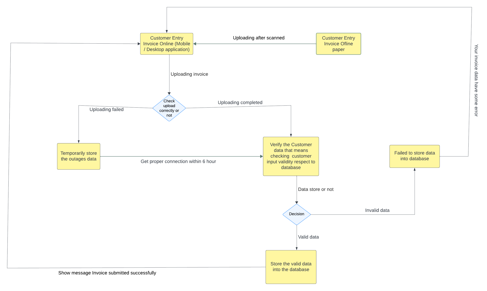

# Design a Real-Time Invoice Processing System for Bangladesh's SME Sector with Intermittent Internet Connectivity

Task Description: 
Context & Scenario: 
You're building an AI-powered invoice processing platform for small and medium 
enterprises (SMEs) in Bangladesh. The system needs to extract data from invoices, 
validate information against supplier databases, and sync with accounting software. 
However, 40% of your target users operate in areas with unreliable internet connectivity 
(similar to the 13.7% rural connectivity challenge in emerging markets). Power outages 
occur 2-3 times daily for 15-30 minutes each.

Business Constraints:

● Monthly budget per client: $15 USD

● Must handle 200-500 invoices per month per client

● 60% of invoices are handwritten or poorly scanned

● Clients use a mix of desktop computers and mobile devices

● Data privacy regulations require data to stay within Bangladesh.

My Task: 
Design a system architecture that balances: 
1. Offline-first functionality vs. Cloud-based AI processing capabilities 
2. Data accuracy and validation vs. Processing speed during connectivity windows 
3. Local device storage constraints vs. Centralized data consistency 
4. Cost efficiency vs. Feature richness

My Deliverables: 

● High-level architecture diagram showing data flow in both online and offline 
modes

● Justification for your synchronization strategy and conflict resolution approach 

● Trade-off analysis explaining why you chose specific technologies 

● Failure mode analysis: What happens during extended outages (6+ hours)
  
<h1>My solution:</h1>

 
<a href="https://lucid.app/lucidchart/4d4fcdb6-451f-47f7-b06b-b125a0840766/edit?viewport_loc=-3022%2C-1377%2C4657%2C2534%2C0_0&invitationId=inv_499ee04f-0c8c-4eb6-b3ea-4795da14d8ae"><h3> Block diagram of my SMC invoice</h3></a>

<h4> 1. Offline-first functionality vs. Cloud-based AI processing capabilities:</h4>

<li>Offline-first functionality:</li>

i. In offline functionality there needs to be made invoice manually which is very time consuming.

ii. Offline functionality is very easy for village and illiterate people because they can’t understand online cloud-based AI processing functionality.

iii. There haven’t faced outages which also face in online cloud-based AI processing functionality.

iv. There haven’t faced lower connectivity problems which also face in online cloud-based AI processing functionality.

<li>Cloud-based AI processing:</li>

i. In online Cloud-based functionality there needn’t to be made invoice manually which is less time consuming.

ii. Online Cloud-based functionality is very easy for city and literate people because they understand online cloud-based AI processing functionality.

iii. There sometime face outages which isn’t faced in Offline functionality.

iv. There sometime face lower connectivity problems which isn’t faced in Offline functionality.

v. During data uploading time if there face any outages and low connectivity problems then it will store temporarily. When there will be reconnection within 6 hours then it will to API for validation.

<h4>2. Data accuracy and validation vs. Processing speed during connectivity windows:</h4>
<li>Data accuracy and validation:</li>

When customers submit their invoice then the API check those data are valid or not. If submitted data are valid then it will store into database and also give a successful message so that the customers can understand that their invoice completed successfully. On the other hand if the submitted data aren’t valid then it fail to store into database and also give an error message so that the customers can understand that their invoice have some error.
<li>Processing speed during connectivity windows:</li>
When customers submit their invoices then those data will be checked for validation in between 1 or 2 seconds. If invoices data are valid then it will be stored in the database and give a successful message to the customer. On the other hand, if invoice data are invalid then it will fail to store into database and give an error message. Both processes will be completed in between 1 or 2 seconds.

<h4>3. Local device storage constraints vs. Centralized data consistency:</h4>
<li>Local device storage constraints:</li>

Local device storage means when all the data of the invoices are stored onto a local computer and those data can be updated and deleted from that desktop computer. But it has some problems or constraints if the computer CPU or memory suddenly will face any problem then those data can’t store or access. Besides we can’t remote access those data from another device.
<li>Centralized data consistency:</li>
Centralized data consistency means when all the data of the invoice are stored into a centralized cloud computer such as Amazon Web Services (AWS), Microsoft Azure, and Google Cloud Platform (GCP) etc. It has a great benefit that is when our local device faces any problems then it can’t hamper data storing and accessing. Besides, we can remote access those data from another device.

